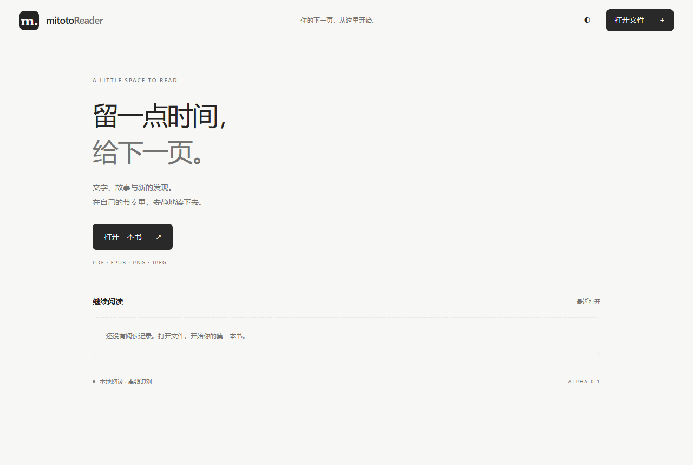

# mitotoReader

独立的 Windows 离线阅读器。现代、极简、黑白灰界面。

**0.2.0-alpha.1 是功能测试版。** 完整多格式阅读器仍在后续路线中。



## 测试版范围

- PDF：翻页、缩放、页码跳转、文字选择与复制、目录。
- EPUB：目录、横排/竖排、ruby、字体/字号/行距/页边距、阅读位置和单书设置。
- PNG/JPEG：查看、缩放。
- 当前 PDF 页或图片：离线中/日/英 OCR、取消、可编辑结果、复制、导出 TXT。
- 最近阅读、深浅色主题、可收起的阅读工具和侧栏。

## 本轮新增：阅读与书库

- PDF / EPUB 全文搜索与结果跳转；PDF 搜索文字层，扫描页需另用 OCR。搜索可停止，最多显示 200 个结果。
- 单书书签，保存 PDF 页码或 EPUB CFI 位置；重开后恢复。
- PDF / 图片默认适应整页，可切换适应宽度或手动缩放；窗口变化时自动调整。EPUB 重排保留位置。
- 全屏、窄窗口侧栏覆盖布局、宽窗口并排布局、快捷键帮助与支持减少动态效果的轻量动画。
- 持久书库：多选导入、按内容去重、书名 / 作者搜索、格式筛选、排序、阅读进度、分批显示。首次打开后提取元数据和缩略封面。
- 移出书库不删除原文件，重新添加同一文件保留阅读位置与书签；文件移动后可重新定位，通过内容哈希校验原书。
- 旧版最近阅读自动迁移到书库。EPUB 全书进度按章节及章内页数估算，不代表精确字数比例。

## 本轮新增：OCR 与资源控制

- 框选识别、识别前旋转 90° / 180° / 270°，可选黑白文字对比度增强。
- PDF 批量页码，例如 `1-5, 8`，每批最多 100 页，逐页处理；多页批量使用整页。取消保留已完成结果，切换文档清理当前任务。
- 按文档内容、页码、语言、布局、区域和预处理参数缓存结果，缓存目录 `mitoto-data/ocr-cache/`，上限 32 MiB。编辑结果仍需复制或导出，缓存保存的是原始识别文本。
- 同语言复用一个识别引擎，空闲 90 秒后释放；换语言或取消时释放。PDF OCR 默认 200 DPI，输入最多 400 万像素。
- PDF 显示画布最多 800 万像素；搜索仅保留有限页的文本缓存；未变化文件复用哈希；配置合并写入并在关窗前完成保存。

文件留在本机；不使用遥测、远程字体、在线识别或更新检查。EPUB 内脚本禁用，外部网络请求被阻止。

## Windows 下载

前往 [GitHub Releases](https://github.com/Fiochanqwq/mitotoReader/releases/tag/v0.2.0-alpha.1)。推荐下载 `mitotoReader-0.2.0-alpha.1-Setup.exe`，双击安装后从桌面或开始菜单启动。无需安装开发环境；安装版阅读数据保存在 `%APPDATA%/mitotoreader/`，卸载时保留。

也可选择便携 ZIP：

解压整个发行包，双击 `mitotoReader.exe`。保留随包文件。设置写入同目录 `mitoto-data/`；请放在当前用户可写的目录。OCR 引擎、语言数据、PDF 字体资源和 Chromium 运行时都包含在包内。

`Ctrl+O` 打开文档；`PageUp/PageDown` 翻页；`Esc` 收起侧栏。固定版式文档保留原件字体和颜色；排版面板仅用于 EPUB。

`Ctrl+F` 搜索、`Ctrl+D` 添加 / 移除书签、`F11` 全屏、`Ctrl+＋/−` 缩放、`Ctrl+0` 适应整页。`Esc` 按顺序关闭快捷键帮助、取消框选、关闭侧栏或退出全屏。文字输入时不响应翻页、书签和缩放快捷键；底部 `?` 可查看帮助。

## 从源码运行

需要 Windows x64、Node.js 24、npm 和 PowerShell；可使用 Bun 或 Node.js 24 执行构建脚本。首次获取依赖和模型需要联网；之后应用运行可断网。

```powershell
npm ci
node cmd/build.ts
npm start
```

应用构建入口为 `cmd/build.ts`，安装器入口为 `cmd/installer.mjs`。OCR 模型的来源、固定提交和 SHA-256 记录在 `resources/models.lock.json`；缓存损坏会使构建失败。Electron 二进制由其 npm 安装脚本依据随包校验清单验证。

## 针对性测试

```powershell
pwsh tests/generate-reader-fixtures.ps1
npm test
node tests/ocr-languages.mjs
```

测试通过 Playwright 启动实际 Electron 应用，使用隐藏窗口和独立配置目录；生成的 PDF 和 OCR 导出保存在 `tests/tmp/`。不覆盖正常阅读记录。截图需可用的图形桌面并显式设置 `MITOTO_CAPTURE=1`；`node tests/visual.mjs` 可通过无界面浏览器生成设计截图，但不代替桌面集成测试。

启动回归不打开窗口：`node --test tests/startup.test.cjs tests/runtime.test.cjs`。

## 打包

```powershell
node cmd/build.ts --package
npm run installer
```

输出便携目录 `release/mitotoReader-0.2.0-alpha.1-win32-x64/`，以及 `release/installers/mitotoReader-0.2.0-alpha.1-Setup.exe`。打包后再次运行测试：

```powershell
$env:MITOTO_TEST_EXE = (Resolve-Path 'release/mitotoReader-0.2.0-alpha.1-win32-x64/mitotoReader.exe').Path
npm test
```

## 限制与后续路线

- 单文档阅读；测试版文件上限 256 MB。密码 PDF 尚不支持。
- OCR 支持当前页或指定页码批量识别，输入最大 400 万像素；识别结果须人工核对。小字可优先框选，但当前会先按页面预算栅格化，再裁剪。
- 页面、连续文字块和单行文字可选择不同识别布局；日文竖排使用竖排布局。单行日文在自动页面分析下可能重复识别，建议选择“单行文字”。
- 本次不包含 Office、其他电子书/漫画格式、批注、自动纠偏、翻译或公式/表格/手写专项模型。书库引用原文件，不复制保管文件，也尚无分组和标签。
- 无 DRM 绕过、同步、朗读或 AI 问答。
- 更多真实书籍、复杂 EPUB、Windows 10、无障碍和低配机器需要后续验证。

这些能力仍在后续产品路线中，不视为本次已实现。测试证据和未通过项见 `TESTING.md`。

## 来源与许可证

项目采用 GPL-3.0-only。EPUB 排版逻辑由先前阅读器实验迁移并改造；不调用 Sumatra 可执行程序或链接其引擎。依赖独立遵循各自许可证，见 `THIRD-PARTY.md` 和构建生成的 `build/licenses/`、`build/components.json`。界面为原创代码实现。
